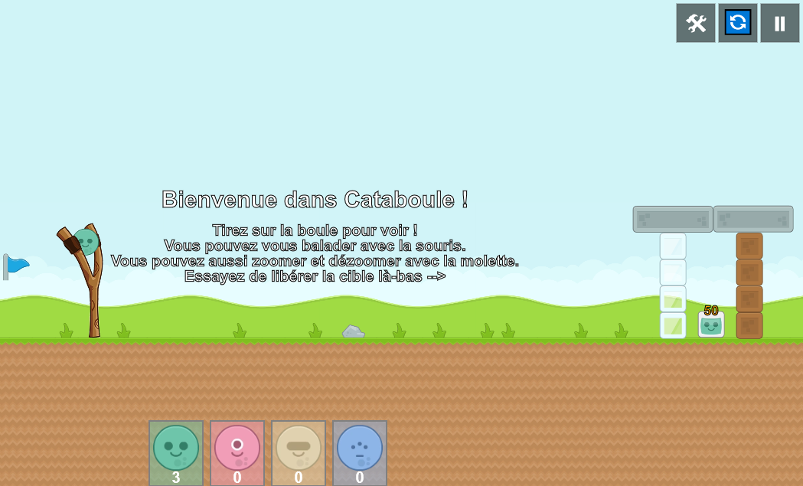

# Cataboule
## Par Alexandre l'Heritier
Jeu de catapulte en JavaScript.

[Pour jouer au jeu, c'est ici !](https://alexlher.github.io/Cataboule/)

Projet WEB M1S2 :
https://www.lri.fr/~kn/teaching/js/projet/2019-2020/projet_m1_info_2019-2020.pdf

"Le but de ce projet est de concevoir un jeu de catapulte (de type Angry Birds, mais plus modeste) en HTML5 + Javascript."

## Fonctionnalités de base
- Toutes implémentées.

## Fonctionnalités avancées
- Toutes implémentées.

# Derniers changements :

## [Version 1.23 / Build F200514.1] - 2020-05-14

### Fixed

- Correction au niveau du changement de niveau après chargement d'un niveau perso.

## [Version 1.22 / Build F200510.1] - 2020-05-10

### Changed

- Le bouton "Continuer" devient le bouton "Jouer".

### Fixed

- Correction au niveau de la récupération d'un niveau suivant inexistant.
- Correction au niveau de l'actualisation de maxCookie.
